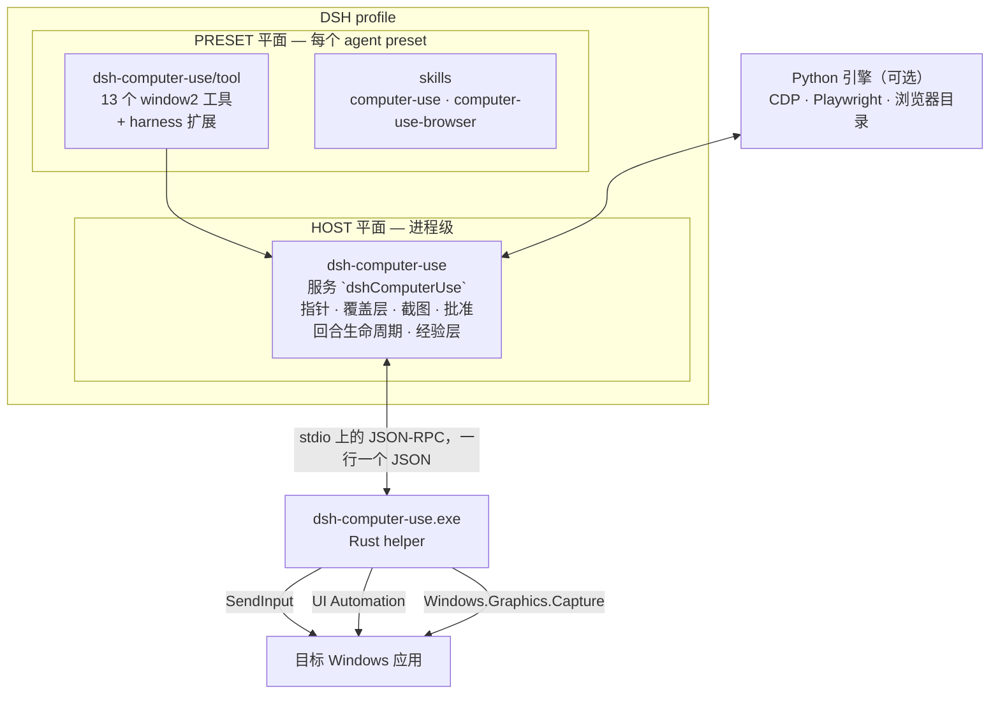
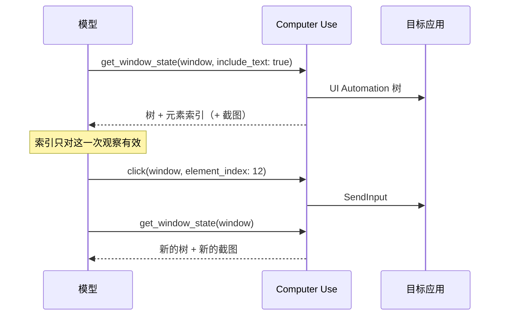

<div align="center">

# DeepSeek Harness · Computer Use

**让 DeepSeek Harness 直接操作 Windows 桌面应用与 Chromium 标签页。**
**参考Codex 的 `window2` 工具面**，**在DSH上体验Codex版的Computer Use**

[English](README.md) | 中文


*截止到此插件发布前，官方已经在实验性版本更新Computer Use。总体设计思路与本插件有差异。目前本插件已做兼容性处理，可以同时安装两个插件，但不建议同时启用。*

</div>

---

## 目录

- [它能做什么](#它能做什么)
- [快速开始](#快速开始)
- [工作原理](#工作原理)
- [工具面](#工具面)
- [观察—动作—刷新循环](#观察动作刷新循环)
- [安全模型](#安全模型)
- [经验层](#经验层)
- [配置](#配置)
- [浏览器自动化](#浏览器自动化)
- [验证](#验证)
- [从源码构建](#从源码构建)
- [仓库结构](#仓库结构)
- [故障排查](#故障排查)
- [安全与隐私](#安全与隐私)
- [兼容性与已知差距](#兼容性与已知差距)
- [许可与归属](#许可与归属)

---

## 它能做什么

| | |
|---|---|
| **完整的官方工具面** | Codex官方 `window2` 的全部 13 个方法 —— `list_windows`、`get_window`、`list_apps`、`launch_app`、`get_window_state`、`click`、`press_key`、`type_text`、`scroll`、`set_value`、`drag`、`perform_secondary_action`、`activate_window` —— 名称、参数、默认值、返回体与错误串都与Codex一致。 |
| **真实输入与真实截图** | 输入走 `SendInput`，无障碍树走 UI Automation，截图走 `Windows.Graphics.Capture`（窗口被遮挡也能拍）。截图以视觉 image part 送达模型，JSON 里不含 base64。 |
| **可见、可中断的覆盖层** | 状态药丸 + 带弹簧动画的合成光标，绘制在 layered window 且被排除出捕获。任何时候按 **Esc** 都能中断当前回合。 |
| **对照真机验证** | 行为对着官方插件与其 helper 做门禁：AX 树语法、覆盖层像素、光标运动、截图新鲜度、传输预算、批准文案、回合生命周期。 |
| **Harness 原生，不是 MCP 套壳** | DSH 工具 + 随包技能，而不是一个 JavaScript REPL。插件本身是一个 DSH **bundle**：`package.json` + `cordis.patch.yml` + 包根目录下的入口模块。 |
| **双平面、单 sidecar** | 桌面是进程级资源：指针、覆盖层、截图与批准流放在 HOST 平面；模型可见的工具放在 agent preset，普通编码会话不会拿到鼠标。 |
| **经验层** | 任务结束后写入本机笔记，下一次任务执行前作为参考回放 —— 见[经验层](#经验层)。 |

---

## 快速开始

### 环境要求

| | |
|---|---|
| 操作系统 | Windows 10 1809+ 或 Windows 11，**x64** |
| Harness | DeepSeek Harness（源码 checkout 或已安装的 `dsh` CLI） |
| Node | 20 或更高 |
| Python | 3.10+ —— 仅浏览器目录需要；13 个桌面工具是 Rust + Node |
| Rust | 仅在你重新编译 helper 时需要（`helper-rs/bin/win32-x64/` 已随包提供 release 二进制） |

### 1. 安装 bundle

```sh
# 从 GitHub 安装（无构建步骤、无安装期脚本）
dsh plugin --profile web add github:wushi2333/dsh-computer-use_codex-style

# 从本地 checkout 安装
dsh plugin --profile web add /path/to/dsh-computer-use_codex-style

# 从打包好的 tarball 安装
dsh plugin --profile web add ./dsh-computer-use-0.1.0.tgz
```

包内声明了 `dsh.bundle.patch`，所以 `dsh plugin` 会把 HOST 平面的行加进 profile 并链接该包。插件是纯 ESM JavaScript 加一个预编译 helper，**没有 `prepare` / `postinstall` 脚本**，pnpm 不会要求你额外允许构建。

### 2. 把工具行加进 agent preset

桌面工具**故意**放在 **agent preset** 里，而不是 host 组合里。挑一个你愿意交出鼠标的 preset，在它的 `agent.cordis.yml` 里加一行（preset 位于 `$DSH_HOME/.agent-presets/<name>/`）：

```yaml
# Computer Use 工具消费 HOST 的 dshComputerUse sidecar，本身不发布任何服务，
# 因此像 tool-bash 一样松散放置。请先在 profile 里安装 dsh-computer-use
# bundle，否则这一行会一直等待服务。
- id: tool-computer-use
  name: dsh-computer-use/tool
  config:
    surfaces:
      - computer
    browserSkill: computer-use-browser
```

建议给 Computer Use 单独留一个 preset：用 `standard` 启动的会话保留原有工具集，永远不会碰到你的鼠标。

### 3. 投递技能

两个技能随包提供，需要复制到 harness 读取的技能根目录：

```sh
# 在 profile 目录下执行
node node_modules/dsh-computer-use/scripts/sync-skills.mjs --write --defaults

# 之后随时核对副本（只报告漂移，不写文件）
node node_modules/dsh-computer-use/scripts/sync-skills.mjs --check --defaults
```

`--defaults` 指向 `$DSH_HOME/.agent-presets/computer-use/skills` 与 `$DSH_HOME/skills`；其他根目录用 `--target <dir>`。

### 4. 重启并开跑

重启对应 profile（插件面改动在启动时读取），用你的 Computer Use preset 新建会话，然后给它一个具体任务：

> 打开记事本，把这几条要点整理成一份干净的草稿。

第一次工具调用会拉起 helper，药丸出现，模型开始它的「观察 → 动作 → 刷新」循环。

### 卸载

```sh
dsh plugin --profile web remove dsh-computer-use
```

如果你手工加过 preset 行和技能副本，一并删除。

---

## 工作原理



**一个进程一个 helper，同一时刻一个回合。** sidecar 惰性拉起 `dsh-computer-use.exe` 并常驻；每个请求都带会话 + 回合身份，回合作用域变化时发送 `end_turn` —— 它会冲刷观察租约、隐藏覆盖层并恢复系统光标。这与官方一致：官方的 `Stop` / `Interrupt` / `SubagentStop` 钩子都调用 `turn_ended`。

**新鲜度靠身份，不靠时间。** 没有 TTL：窗口身份、包围盒与人机输入监视器一致时观察才有效。只要有人碰了被观察的窗口，下一次输入就会以 `user input was detected in this window; call get_window_state before continuing` 被拒绝。

**没有任何动作会被静默批准。** `launch_app` 与音频录制会暂停等待 harness 批准 UI，批准按应用记忆，被拒绝时按官方文案报错而不是重试。唯一的例外是**权限预设已经替你回答了问题**：完全访问会话（或批准策略为「从不询问」的会话）会直接放行应用门禁，`computer_use_health` 里会记录原因。

---

## 工具面

### 13 个Codex官方 `window2` 方法

| 工具 | 用途 |
|---|---|
| `list_windows` | 当前可定位的窗口 |
| `get_window` | 重新水合一个你已持有的窗口绑定 |
| `list_apps` | 已安装应用及其打开的可定位窗口 |
| `launch_app` | 启动应用（可能暂停等待批准） |
| `get_window_state` | 某个窗口的截图 + 完整无障碍树 |
| `click` | 按元素索引或截图坐标点击 |
| `press_key` | 按键与组合键（X keysym 风格名称） |
| `type_text` | 向当前焦点输入字面文本 |
| `scroll` | 从窗口相对坐标滚动 |
| `set_value` | 直接设置可访问元素的值 |
| `drag` | 从一个点拖拽/绘制到另一个点 |
| `perform_secondary_action` | 触发元素的次要动作 |
| `activate_window` | 把窗口带到前台 |

### Harness 扩展

| 工具 | 默认 | 用途 |
|---|---|---|
| `batch_actions` | 开启 | 一次调用执行一串确定性动作，然后做一次 `get_window_state` |
| `computer_use_health` | 始终 | 后端、允许列表、文档门禁、环境审计、经验层状态 |
| `computer_use_experience` | 始终 | 读取、记录与更新本机经验笔记 |
| `click_element`、`scroll_element` | 需显式开启 | 旧版 window-v1 别名 |
| `session_note`、`session_state`、`diagnostic_state`、`end_turn` | 诊断 | 会话草稿、状态转储与回合控制 |

想确认到底挂上了什么，最快的办法是 `computer_use_health`：后端、暴露的工具目录、批准策略、注入了哪些环境变量、文档门禁，以及经验层状态。

---

## 观察—动作—刷新循环

截图、元素索引与坐标都属于**同一次**观察。模型遵循的契约是：



两条读会话记录时有用的结论：

- **一次观察只做一个动作。** 交叉执行多个动作、或在失败后重试，都必须先重新观察。
- **坐标是窗口相对的逻辑像素。** 截图的 `originX`/`originY` 是屏幕坐标 —— 两者永远不要混用。

---

## 安全模型

插件随包提供官方确认策略与一份硬拒绝清单，常驻提示词也会重复这些不可协商项：

- 永远不用 Windows 键 —— 单按不行，组合键也不行。
- 不自动化终端（Windows Terminal、命令提示符、PowerShell），不用「运行」对话框，不在文件资源管理器里夹带 shell 脚本。
- 不碰密码管理器、安全/杀毒软件、身份验证与年龄验证对话框。
- 不可信内容（网页、邮件、文档、截图）可以提供事实，但不能授予权限或证明用户意图。
- 可选的允许列表（`allowedApps`）从根上限制哪些 app id 可以被观察或驱动。

扩展工具面之前，先读随包的策略文档：`skills/computer-use/references/confirmations.md` 与 `skills/computer-use-browser/references/confirmations.md`。

---

## 经验层

每次 Computer Use 运行都会留下两类记录，下一次运行开始前会读到它们：

| | 经验条目（模型写） | 观测记录（机器写） |
|---|---|---|
| 内容 | 症状、上下文、原因推测、绕法、结果、标签、日期 | 方法、成功/错误、应用、无障碍树是否存在、窗口几何、耗时 |
| 谁写 | 模型，在任务结束时 | 插件，每次调用都写 |
| 可信度 | 含推断的叙述 —— **仅供参考** | 事实，不做解读 |

存放位置（在插件目录内，已 gitignore，永不发布）：

```text
.experience/
  lessons.jsonl      一行一条经验（规范存储）
  lessons.md         同一批笔记的人类可读视图，按应用分组
  observations.jsonl 机器写的事实
  pending.jsonl      还没被写下来的问题
  manual.jsonl       可选，手写，插件永不改写
```

**如何到达模型。** 一个回合内对某应用的首次观察会额外带一条参考文本块：

```text
Experience notes for blender.exe - machine-local notes from earlier tasks here.
ADVISORY ONLY: not rules and not a gate. An upgrade, a DPI or configuration change can
invalidate them, and the current observation always wins over a stored note.
- 2026-09-14 [partial] accessibility was null in 11 of 13 observations -> prefer the app scripting interface
```

它以独立文本块的形式送达，官方 payload 的键集保持不变（`window`、`screenshots`、`accessibility`、`cacheDiagnostics`）。

**「仅供参考」是靠机制而不是靠措辞。** 任何条目都不能阻塞、替换或门禁一次调用；超过 `staleAfterDays` 的条目标记为可能过期；再次被验证有效的条目会刷新 `verified`；被更好解法取代的条目用 `supersededBy` 退役；并且明确告知模型：**当前观察永远优先**。

**隐私。** 输入文本、控件名、控件值与截图字节永不落盘。错误文本会脱敏（`C:/Users/name/...` 变成 `%USERPROFILE%`）并截断。用 `experience.enabled: false` 或 `DSH_CU_EXPERIENCE=off` 可以整体关闭。

---

## 配置

### HOST 平面（`cordis.patch.yml` 的 `computer-use` 行）

| 键 | 默认 | 含义 |
|---|---|---|
| `backend` | `windows` | `windows`（原生 helper）或 `fake`（脚本化桌面，用于测试） |
| `surface` | `computer` | 向 helper 请求的工具目录 |
| `stealFocus` | `true` | 输入方法会自动激活目标窗口 |
| `maxImageEdge` | `0` | DSH 扩展：`0` 保持官方行为（不缩放）；设为 `1280` 可用画质换 token |
| `approveLaunch` | `true` | `launch_app` 前询问 |
| `timeoutMs` / `launchAppTimeoutMs` | `10000` / `15000` | 官方请求预算；超时会拒绝在途请求 |
| `startupTimeoutMs` | `15000` | helper 启动预算 |
| `preserveHelperOnTimeout` | `false` | 超时后保留 helper 以便排查 |
| `allowedApps` | `[]` | 非空时只有这些 app id 可被观察或驱动 |
| `envAllowlist` | `[]` | 在随包允许列表之外额外转发给 helper 的环境变量名 |

### 经验层（同一行上的 `experience.*`）

| 键 | 默认 | 含义 |
|---|---|---|
| `enabled` | `true` | 读写笔记的总开关 |
| `store` | `""` | 空表示 `<pluginRoot>/.experience` |
| `captureObservations` | `true` | 是否写机器观测事实 |
| `injectDigest` | `true` | 是否把参考块附在匹配应用的首次观察上 |
| `maxEntries` / `maxChars` | `3` / `900` | 注入预算 |
| `staleAfterDays` | `90` | 超过这个天数的条目标记为可能过期 |
| `includeStale` | `true` | 设为 `false` 时过期条目完全不注入 |
| `retainEntries` / `retainObservationDays` | `200` / `30` | 保留策略 |
| `redactPaths` | `true` | 对记录下来的错误文本做本地路径脱敏 |

### PRESET 平面（`dsh-computer-use/tool` 行）

| 键 | 默认 | 含义 |
|---|---|---|
| `surfaces` | `[computer]` | 暴露哪些目录（`computer`、`browser`、`mac`、`all`） |
| `browserSkill` | `computer-use-browser` | 解锁浏览器目录的技能名 |
| `approvalDefault` | `prompt` | helper 因批准而拒绝时的行为：`prompt`、`allow`、`deny`。完全访问会话（或批准策略为「从不询问」的会话）直接放行且不询问；显式 `deny` 仍然失败关闭 |
| `approvalTools` | `{}` | 按工具覆盖上面的策略 |
| `enabledTools` | `[batch_actions]` | 哪些 harness 扩展进入模型可见目录 |

---

## 浏览器自动化

同一个 sidecar 还提供 Chromium 面：标签页、CDP 调用与事件、DOM 与无障碍快照、Playwright 风格交互、下载，以及通过随包 Chrome 扩展认领已登录标签页，共 `95` 个工具。

它是**技能门控**的：模型加载 `computer-use-browser` 技能前这些工具不会注册，普通会话的目录不会被淹没。浏览器路径是 Python 3.10+（`computer_use/`），通过 CDP 连接浏览器，不经过桌面 helper。

---

## 验证

一切都能在本仓库复现。插件面门禁完全不需要桌面：

```sh
# 在 DeepSeek Harness checkout 下运行，以便解析 peer 依赖
node --import tsx/esm --test tests/contracts.test.mjs tests/experience.test.mjs

# helper（Rust）
cargo test --release --manifest-path helper-rs/Cargo.toml

# 引擎（Python）
python -m pytest -q

# fake 后端冒烟：不需要桌面，也不会碰鼠标
node src/smoke.mjs
```

当前状态（Windows 11 x64）：**插件门禁 38/38**（25 条契约 + 13 条经验层）、**Rust 202 通过**、**Python 289 通过 / 1 跳过**、fake 后端冒烟通过。

parity 套件会操作真实桌面，把本插件与官方实现逐项对比 —— 覆盖层像素、光标运动、截图新鲜度、window-state 用例、传输预算、AX 树字节、插件生命周期：

```powershell
pwsh -File parity/verify-all.ps1
```

它需要一个准备好的桌面（一个 `Parity Target` 窗口，AX 对比还需要 Word 与资源管理器），缺少夹具时会报 SKIP 而不是给出虚假的 PASS。开发证据 —— 逆向报告、差距登记册与验证日志 —— 刻意不放进公开源码树。

---

## 从源码构建

```sh
# JavaScript 插件：无需构建，纯 ESM
node src/exports-check.mjs

# Rust helper：构建、测试，并发布插件随包的二进制
pwsh -File scripts/ship-helper.ps1

# Python 引擎（可选浏览器面）
python -m pip install -e .
```

`scripts/ship-helper.ps1` 会跑 `cargo build --release`、helper 测试套件，把 `dsh-computer-use.exe` 复制到 `helper-rs/bin/<platform>-<arch>/` 并打印 SHA-256。因为该二进制已被跟踪，全新 checkout 无需 Rust 工具链也能直接运行。

想在开发时直接指向 checkout 而不是安装副本：

```sh
dsh plugin --profile web add /path/to/dsh-computer-use_codex-style
```

---

## 仓库结构

```text
package.json            DSH bundle 清单（dsh.bundle.patch + dsh.skills）
cordis.patch.yml        本 bundle 插入的 HOST 平面层
dsh-plugin.json         Codex 风格的插件清单（身份、界面、工具列表）
src/
  index.js              HOST 服务：sidecar 生命周期、回合生命周期、health
  tool.js               PRESET 行：工具注册、批准、文档门禁
  sidecar.js            helper 传输：启动、JSON-RPC、预算、路由
  experience.js         经验层：存储、digest、观测、待补记
  prompt.js             常驻提示词段 + 按需参考文档清单
  paths.js              helper / python 发现逻辑
skills/
  computer-use/         桌面技能及其参考文档
  computer-use-browser/ 浏览器技能及其参考文档
helper-rs/              Rust helper（输入、UIA、截图、覆盖层、光标）
  bin/<platform>-<arch>/  随包发布的 release 二进制
helper-swift/           macOS helper 源码（尚未提供二进制）
computer_use/           Python 引擎（CDP、Playwright、浏览器目录）
parity/                 验证套件与夹具
tests/                  插件与引擎测试
docs/                   插件说明与图片资源
```

---

## 故障排查

| 现象 | 含义 |
|---|---|
| 函数列表里没有 Computer Use 工具 | 会话没有用挂载 `dsh-computer-use/tool` 的 preset，或者安装 bundle 后没有重启 profile。 |
| `The Windows Computer Use helper may have failed` | helper 没在 `startupTimeoutMs` 内启动。检查允许列表与环境允许列表后重试；`computer_use_health` 会报告实际注入了什么。 |
| `coordinate input target is unavailable` | 观察已过期或窗口已变化。重新 `get_window_state` 并对新结果操作。 |
| `user input was detected in this window` | 有人用过这个窗口。下一次输入前必须重新观察。 |
| 运行过程中焦点跳动 | `stealFocus: true` 的预期行为：输入方法会激活目标窗口。 |
| 桌面被锁定 | Computer Use 会停下并要求你解锁，它绝不操作 `LockApp.exe`。 |
| 屏幕上出现两个光标 | 覆盖层会画一个合成光标并把系统光标置空。真出现两个时，读 `diagnostic_state` → `overlayState.systemCursorFailures`：计数非零说明压制失败，那是设计上唯一会通向「双指针」的路径。 |
| 某应用的无障碍树不可用 | 自绘 UI 常见。走截图路径，或优先使用该应用自带的脚本接口，然后用 `computer_use_experience` 把结论记下来。 |

---

## 安全与隐私

- **Agent 控制的是真实的鼠标、键盘与屏幕。** 请只在你能接受这一点的会话里使用 Computer Use，并保持拒绝清单完整。
- **批准是显式的。** `launch_app` 与音频录制会暂停等待 harness 批准 UI；没有任何动作会被静默批准，被拒绝的请求也绝不重试。完全访问（或批准策略为「从不询问」）的会话除外：那是用户自己的选择，插件按 `allow` 放行并留下审计记录。
- **经验层是本机且有界的。** 它位于插件目录内、已 gitignore、永不打包，也永不记录输入文本、控件名或截图字节。
- **截图是视觉 part。** 它们以图片附件形式送达模型，JSON 工具结果里不含 base64。
- **不可信内容始终不可信。** 网页、文档与邮件可以给模型提供信息，但无权授权任何动作。

---

## 兼容性与已知差距

本插件对标的基线是 Codex Computer Use 插件 `26.903.61454`：相同的 13 个方法、相同的参数名与默认值、相同的返回体、相同的错误串、相同的 AX 树语法、相同的预算、相同的覆盖层语义。

DSH官方的Computer Use采用设计思路不大一致。如果希望使用Codex风格的功能，可以使用本插件。


---

## 许可与归属

MIT —— 见 [LICENSE](LICENSE)。

这是面向 DeepSeek Harness 的独立重实现，与 OpenAI **没有**隶属、背书或赞助关系。Codex 是 OpenAI 的商标，此处提及仅用于描述行为兼容性。

仓库中包含逐字复制的第三方材料，它们保留各自的条款：

- `helper-rs/assets/prompts/` 与各技能的 `references/` 目录包含官方 Computer Use 的 guidance、API 参考与确认策略文档，复制它们是为了让模型读到与官方插件相同的文字。
- `parity/golden-ax/` 与 `parity/ax-rich/` 包含官方 helper 产出的无障碍树样本，作为 parity 门禁的对比基线。

如果你要再分发本项目，请按你获取这些文件时所依据的条款复核它们。
